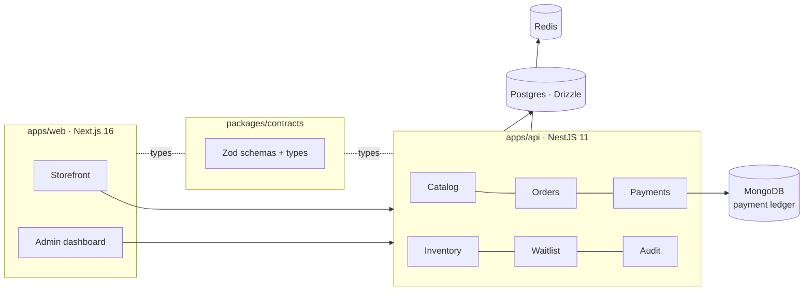

<div align="center">

# 桜 Sakura Book

**A production bookstore for [Nihonova Academy](https://books.nihonovaacademy.com)** — original Bangla-language JLPT / JFT / NAT study books, sold across Bangladesh.

[**books.nihonovaacademy.com →**](https://books.nihonovaacademy.com)


</div>

---

> ### 📊 **500+ orders processed in the first two weeks of launch**
>
> Live, real money, real customers — mobile-money payments (bKash · Rocket · Nagad) and cash on delivery, fulfilled nationwide from a single admin dashboard.

---

## Table of contents

[Frontend](#frontend) · [Design system & theming](#design-system--theming) · [State management](#state-management) · [Routing & rendering](#routing--rendering) · [Performance](#performance) · [Admin dashboard](#admin-dashboard) · [Backend](#backend) · [Infrastructure](#infrastructure) · [Running it](#running-it)

---

## Architecture at a glance



A Turborepo monorepo. `packages/contracts` holds the Zod schemas both sides import, so a request body is validated on the server with the exact object the client was typed against — the API contract cannot drift.

```
sakura-book/
├── apps/web        Next.js 16 storefront + admin
├── apps/api        NestJS 11 REST API
└── packages/contracts   Zod schemas shared by both
```

---

# Frontend

## Design system & theming

The visual language is documented in [DESIGN_SYSTEM.md](DESIGN_SYSTEM.md) and enforced in code — not a Bootstrap-shaped default with a colour swapped.

**Four principles, and everything follows from them:**

| # | Rule | Consequence in code |
|---|------|---------------------|
| 01 | **The book leads** | Covers, titles and prices come first; chrome stays quiet. Covers are the only place the palette opens up. |
| 02 | **One accent, used sparingly** | A single clay `#C96442` marks the primary action and live status. *If two things on a screen are clay, one of them is wrong.* |
| 03 | **State is stated, not implied** | Every status carries a **word** as well as a colour — survives touch screens and colour-blind readers. |
| 04 | **Motion only as confirmation** | Navigation is instant. One 150ms press state, one 1400ms loading shimmer. Nothing else moves. |

<table>
<tr><th align="left">Layer</th><th align="left">How it works</th></tr>
<tr><td><b>Tokens</b></td><td>Two-layer <a href="apps/web/src/styles/theme.css">theme.css</a>: <code>:root</code> CSS custom properties are the runtime palette; Tailwind v4 <code>@theme</code> declarations reference them, so <code>bg-clay</code> follows the runtime value. Retheme without touching a single utility class.</td></tr>
<tr><td><b>Dark mode</b></td><td>Three-state — explicit <code>data-theme="dark"</code>/<code>"light"</code> on the root wins in both directions, and unset falls through to <code>prefers-color-scheme</code>. Every token is redefined per state; no colour is defined only inside a media query.</td></tr>
<tr><td><b>Type</b></td><td><b>Lora</b> for titles, <b>Public Sans</b> for interface, <b>Playfair Display</b> for the landing hero only — all via <code>next/font/google</code>, self-hosted at build time with zero layout shift.</td></tr>
<tr><td><b>Semantics</b></td><td>Deliberately not traffic lights: success is <b>ink, not green</b>. White cards on cream, 1px rules instead of shadows, 8px radius on controls and 12px on containers. No gradients, no second accent.</td></tr>
<tr><td><b>Primitives</b></td><td>18 headless-ish components in <a href="apps/web/src/components/ui">components/ui</a> — button, field, modal, select, stepper, notice, skeleton — variants typed with <code>class-variance-authority</code>, classes merged with <code>tailwind-merge</code>.</td></tr>
<tr><td><b>Domain layer</b></td><td>A second tier above the primitives (<a href="apps/web/src/components/domain">components/domain</a>): book card, cover, order status timeline, payment options, PDF sample reader, waitlist form — the shop's vocabulary, not generic widgets.</td></tr>
</table>

## State management

State is assigned by **where it lives and how long it lasts** ([docs/state-management.md](docs/state-management.md)) — one tool per category, no overlap:

| State | Owner | Why |
|-------|-------|-----|
| Books, orders, order status | **TanStack React Query** | Server-owned and can go stale — cached and revalidated, never mirrored into a client store |
| Cart | **Redux Toolkit + redux-persist** | Client-owned, must survive a refresh or tab close → localStorage |
| Shipping, payment, search forms | **React Hook Form + Zod** | Field wiring plus schema validation, resolver shared with the API contract |
| Modals, drawers | **local `useState`** | Never needs to be global |

## Routing & rendering

- **App Router** with a top-level `[locale]` dynamic segment — **three locales** (`en` · `bn` · `ja`) via `react-i18next` with lazy resource loading, plus browser language detection.
- **Proxy middleware** ([proxy.ts](apps/web/src/proxy.ts)) resolves and normalises the locale, carries it to server components through an `x-locale` header — the escape hatch for `not-found.tsx`, which takes no props and would otherwise 404 with no locale — and excludes static assets from the locale prefix.
- **Server components by default**; client boundaries only where interaction demands it (cart, forms, PDF reader).
- **`generateMetadata` on every route** — per-locale titles, canonical URLs and Open Graph, plus a generated [sitemap.ts](apps/web/src/app/sitemap.ts) and `metadataBase` so relative asset URLs resolve everywhere.
- **`globalNotFound`** for a correct 404 under a dynamic root segment.
- **Route handlers** for health, analytics config and authenticated file streaming (`/api/files/[...path]`).

## Performance

- **`output: "standalone"`** — a self-contained server bundle; the Docker runner stage ships only `.next/standalone`, with `outputFileTracingRoot` set so hoisted monorepo `node_modules` are traced. Vercel-safe fallback included.
- **`next/dynamic`** on the heavy leaves — the pdf.js sample reader and the admin book form stay out of the initial bundle.
- **pdf.js assets copied at build time** by a prebuild script (worker + CJK cmaps + standard fonts), served from a path the locale middleware deliberately skips — otherwise the worker 404s silently and pdf.js falls back to the main thread.
- **`font-display: swap`** on every face, `text-wrap: balance` on headings, `text-size-adjust` pinned.
- Turborepo caching across `build`, `lint`, `typecheck`, `test`; CI runs all four plus a **migration-drift check**.

---

## Admin dashboard

A full operations console at `/admin` — the surface that actually moved 500 orders.

| Area | What it does |
|------|--------------|
| **Dashboard** | Revenue and order metrics, rendered with a hand-built SVG `bar-chart` — no charting dependency |
| **Orders** | Queue, per-order detail, status transitions through the server-side state machine, accepted-orders view |
| **Payment verification** | Operator confirms a mobile-money transaction against the payment ledger before an order advances; a `payment-safety` component guards the irreversible step |
| **Catalog** | Create/edit books with validated forms and direct **cover and PDF upload** through the storage service |
| **Waitlist** | Restock demand per title, counts per book, purge tooling |
| **Settings** | Payment numbers, shipping regions and postage overrides, restock schedule, notify-books selection |
| **Auth** | Login gate with an `use-admin-gate` client guard over server-side session auth |
| **Theme lock** | The admin surface pins its own theme — an operator's dark-mode preference never changes how a receipt or payment screenshot reads |

---

# Backend

**NestJS 11** — modular, dependency-injected, documented at `/docs` via Swagger. See [docs/backend-architecture.md](docs/backend-architecture.md).

### Modules

`catalog` · `pricing` · `shipping` · `coupons` · `orders` · `inventory` · `payments` · `payment-verification` · `waitlist` · `reviews` · `storage` · `email` · `audit` · `admin` · `health`

### The parts worth reading

| Concern | Approach |
|---------|----------|
| **Validation** | `nestjs-zod` registered as a global `APP_PIPE`, rethrowing the raw `ZodError` so field paths survive to the client. Schemas come from `@sakura/contracts` — the same objects the frontend forms validate against. |
| **Errors** | A `DomainError` hierarchy with one dispatching global filter. Services throw domain errors, **never** `HttpException`; the filter owns all transport mapping, plus a Postgres constraint-code mapper. 4xx logs at debug, 5xx logs with a stack. |
| **Database** | Postgres via **Drizzle + postgres-js** over a pooler, in a `@Global()` module. Every service takes `executor: Executor = this.dbService.db`, so the same method runs standalone or composed inside someone else's transaction. |
| **Concurrency** | Guarded updates as the house idiom: `UPDATE … WHERE still_available` — zero rows means you lost the race. Used for coupon redemption, stock decrement and order transitions. Checkout is **idempotent and single-transaction**. |
| **Order lifecycle** | A status machine where `transition()` is the single write path; every change is appended to `order_status_history`. |
| **Payments** | A `PaymentProvider` port with a registry and two adapters — **cash on delivery** and **manual mobile-money transfer** — plus a webhook route leaning on a unique index (`provider`, `provider_reference_id`) so a replay is a 23505, not a check-then-insert race. Transaction records are reconciled against a **MongoDB** payment ledger. |
| **Events** | `@nestjs/event-emitter` decouples the side effects — order confirmation email and the `units_sold` rollup both listen for `PAYMENT_CONFIRMED` rather than blocking checkout. |
| **Security** | `helmet`, CORS pinned to `WEB_ORIGIN`, JWT admin auth with a roles guard, `public` schema revoked from anon roles, an `audit` module recording privileged actions. |
| **Rate limiting** | Global `ThrottlerGuard` — 300/min default, 10/min on enumerable endpoints, Redis-backed in production. |
| **Config** | A Zod env schema validated at boot: the process refuses to start misconfigured rather than failing on first request. |
| **Observability** | `nestjs-pino` with a `genReqId` that reuses an inbound `x-request-id`; `/health`, `/health/live`, `/health/ready`. |
| **Tests** | Vitest over the money and lifecycle logic — the pure code where a bug costs real taka. |

---

## Infrastructure

- **Deployed on a self-managed VPS via [Coolify](https://coolify.io)** — Docker images built from multi-stage Dockerfiles, `docker-compose.yml` with a `backend` profile for local parity.
- **Postgres** (managed) · **Redis** (throttling + cache) · **MongoDB** (payment ledger) · **Supabase Storage** for covers and PDF samples, driven by plain `fetch` rather than pulling the whole client SDK in for two operations.
- **GitHub Actions** on every push: lint → typecheck → test → migration-drift.

## Running it

```bash
npm install
npm run dev          # web only
npm run dev:all      # web + api
npm run docker:up:all
```

| Script | Does |
|--------|------|
| `npm run build` / `lint` / `typecheck` / `test` | Turborepo, all workspaces |
| `npm run db:generate` / `db:migrate` / `db:seed` / `db:studio` | Drizzle Kit (in `apps/api`) |
| `npm run format` | Prettier + `prettier-plugin-tailwindcss` |

**Requires** Node ≥ 20.19 · npm 10.8.

---

<div align="center">

Built by **[Moshiur Rahman](https://github.com/mrahmann0010)** · [books.nihonovaacademy.com](https://books.nihonovaacademy.com)

</div>
