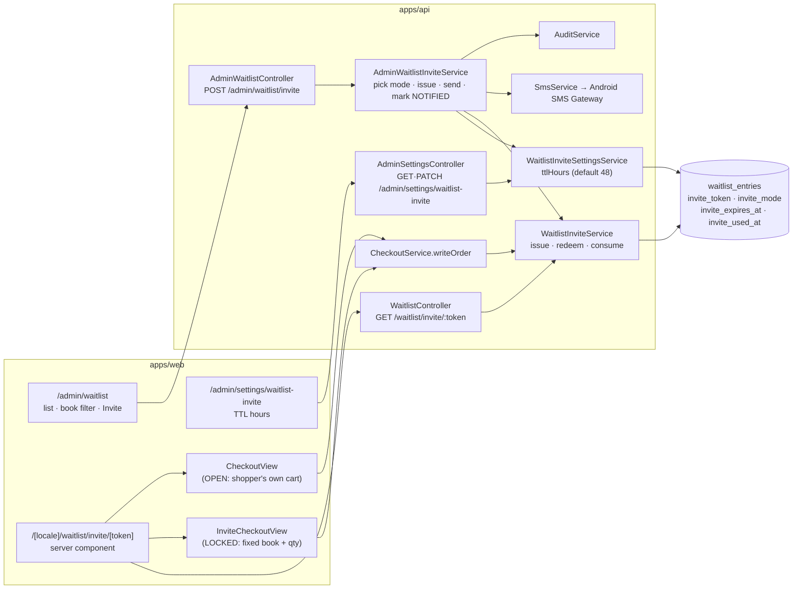
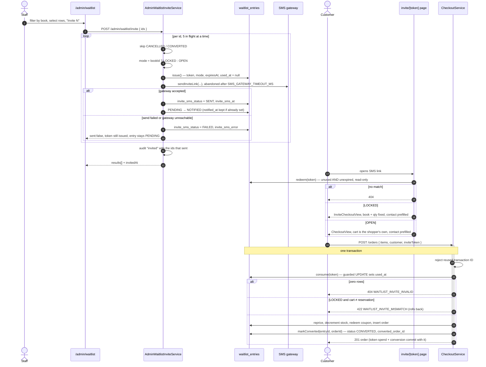
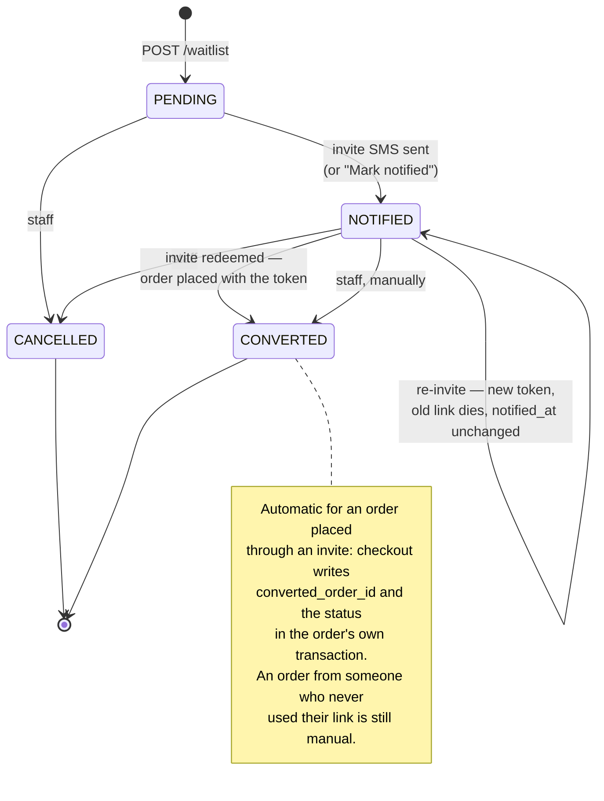

# Waitlist invites

How a waitlist signup becomes an order: staff pick who gets a slot, the API mints a
single-use token, the customer gets it as an SMS link, and checkout spends it in the
same transaction that writes the order. Companion to
[backend-architecture.md](./backend-architecture.md).

---

## 1. Components

---

## 2. Issue → redeem → spend

The ordering inside the transaction is deliberate: the token is spent before pricing
and before any stock moves, so a bad token costs nothing — and because it is one
transaction, a later failure (out of stock, coupon exhausted) rolls the spend back and
leaves the link usable.

---

## 3. Entry lifecycle

Token state lives on the same row, independent of `status`:

| Column              | Set by                | Meaning                                          |
| ------------------- | --------------------- | ------------------------------------------------ |
| `invite_token`      | `issue()`             | The magic-link credential; unique partial index  |
| `invite_mode`       | `issue()`             | `LOCKED` (book + qty fixed) or `OPEN` (any cart) |
| `invite_expires_at` | `issue()`             | `now + ttlHours`, TTL from shop settings         |
| `invite_used_at`    | `consume()`, in-order | Non-null = spent; re-issuing clears it           |
| `invite_sms_status` | `recordSmsOutcome()`  | `SENT` / `FAILED` for the **last** attempt       |
| `invite_sms_error`  | `recordSmsOutcome()`  | The gateway's reason, truncated. Null on success |
| `invite_sms_at`     | `recordSmsOutcome()`  | When that attempt ran — not `notified_at`        |

The three `invite_sms_*` columns are the recovery mechanism for a partial batch. Every
attempt writes one, success or failure, **before** the HTTP response is built — so a
closed tab or a timed-out request no longer takes the list of who to retry with it. The
invite-batch page reads them back as a "Select N failed" button, which re-sends to
exactly the failures rather than to everyone selected.

They are deliberately distinct from `status` / `notified_at`, which answer "has this
person ever been reached" and only move forward. These answer the retryable question:
did *this* send get through. Overwritten per attempt — the audit log keeps history.

`status` and `converted_order_id` are written by `markConverted()` in the same
transaction, right after the order row exists.

---

## 4. Known gaps

- **Conversion only closes for invited orders.** An order placed through a token links
  itself; an order from someone on the list who never used their link is still invisible
  as a conversion, because matching it back would need a rule (phone equality is wrong
  for a shared household number).
- **An invite reserves nothing.** `LOCKED` constrains what the order may contain, not
  whether stock exists — inviting more people than copies is first-come-first-served.
- **Re-issuing resets `invite_used_at`**, so it would hand a second usable slot to
  someone who already ordered — in practice the eligibility check refuses them, since
  redeeming an invite now moves the entry to `CONVERTED`.
- **The SMS is English only**, though `locale` is on the row and used to build the URL.
- **Bulk invites still send inside the request**, five at a time, up to 500 ids. Bounded
  now rather than open-ended — each gateway call is abandoned after
  `SMS_GATEWAY_TIMEOUT_MS` (5s by default), so a batch's worst case is
  `ceil(n / 5) × timeout` rather than unbounded. At the ~20 per click a restock morning
  actually sends that is comfortably inside any proxy cutoff; at several hundred it
  would not be, and the answer there is a job table plus a worker, not a bigger loop.
- **Delivery means "the gateway accepted it"**, not that it arrived. `invite_sms_status`
  records what the Android gateway said; a carrier dropping the message afterwards is
  invisible here, so a customer reporting a missing link is still re-invited by hand.
