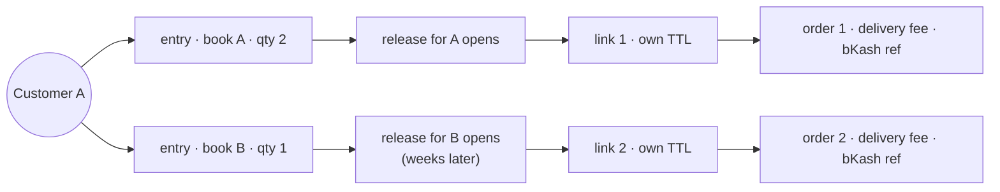

# Invites, baskets and more than one book

What an invited customer may actually buy, and what happens when the same person is
waiting on several titles. Companion to
[waitlist-invite-flow.md](./waitlist-invite-flow.md), which owns the token mechanism,
and [waitlist-queue-system.md](./waitlist-queue-system.md), which owns who gets a link
and when.

This one is about the basket at the other end of the link: the rule checkout enforces
on it, what that rule cost the shop, and what is still unsolved.

---

> **Status:** the two changes in §4 are built. §5 is not, and is the remaining design
> decision.

## 1. The shape of the problem

A signup names exactly one book (`waitlistSubscribeRequestSchema.bookId`), and the pair
of partial unique indexes on `waitlist_entries` allows one entry per (phone, book). So a
customer waiting on three titles is **three independent rows** with three quantities,
three places in three queues, and — since a release and its waves are per book — three
separate invites whenever those books come back.

Nothing about that is wrong on its own. It is the honest data model: the three requests
were made separately and can be cancelled, invited and converted separately. The problem
is what it turns into at checkout, where the customer is one person with one address,
one delivery fee and one bKash transfer to make.



## 2. What the situations actually are

Customer A holds two entries: book A (qty 2) and book B (qty 1).

| Situation                            | What happens                                                                                                                                          |
| ------------------------------------ | ----------------------------------------------------------------------------------------------------------------------------------------------------- |
| A restocked, B still out             | One link for A. B is never mentioned — the page does not acknowledge the second request exists.                                                       |
| A restocked, **B in stock publicly** | The case that mattered most. See below.                                                                                                               |
| Both restocked, both releases run    | Two texts, two live links, two deadlines, two orders. Still true today; see §5.                                                                       |
| Invited for 2, orders 1              | Permitted — the quantity is a ceiling. The unbought copy returns to the shelf at once, and since §4.1 the release is charged for one rather than two. |
| Orders 3 of the 2 held               | 422 `WAITLIST_INVITE_MISMATCH`, transaction rolls back, token stays usable.                                                                           |
| Ignores the link, buys from the shop | No oversell — the arithmetic stays sound — but the entry holds its copies for the rest of the TTL and never closes as `CONVERTED`.                    |

**The second row was a deadlock, not an inconvenience.** With B in stock and A's release
holding its copies, the customer had no path to one parcel:

- through the link — the invite refused any basket that was not exactly book A, so B
  could not be added;
- through the ordinary cart — `publicAvailableSql` is `stock − reserved`, and the cart
  page has no token, so **the customer's own held copies counted against them**. Book A
  read as sold out to the one person it was being held for.

Two orders, two delivery fees, two transfers for staff to reconcile by hand — or, in
practice, one order and a forgotten book.

## 3. The rule, before and after

```
before   items.length === 1
         && items[0].bookId === reserved.bookId
         && 1 <= items[0].quantity <= reserved.quantity

after    sum(quantity of lines naming reserved.bookId) is between 1 and reserved.quantity
         every other line: ordinary pricing and stock rules, no invite involvement
```

The reserved book must still be **present**: a token spent on a basket without it would
mark the entry `CONVERTED` against an order for something else and hand the copies it
was holding to nobody — those other titles need no invite to buy.

Copies are **summed across lines** rather than read off the first one. A cart may name
the same book twice (`PricingService` merges duplicates before pricing), and a ceiling
checked against a single line would let 2 + 2 past a hold of three.

## 4. What was built

### 4.1 A release is charged for the copies actually taken

`waitlist_allocations` never stores what it has spent; every reader derives it by
counting invites. Those readers summed `waitlist_entries.quantity` in every case, which
is right for a hold and wrong for a redemption: an invite's quantity is a ceiling, so
somebody invited for two who ordered one has returned a copy.

The copy went back on the public shelf the instant the token was spent — `reservations.ts`
stops counting a spent invite — while the release went on being charged for it until it
was closed. **The shelf and the budget disagreed about the same copy, and only the shelf
was visible.** On a restock where a third of invitees take fewer than they asked for,
that is a release quietly running short of its own number, with nothing on any screen
explaining why.

One expression now answers "what does this entry cost its release", and `describe`,
`spendableByBook` and the history view's `sold` all call it:

```
charge(entry) =
  entry.quantity                            if invite_used_at is null   (a promise)
  sum(order_items where order = converted_order_id
      and book = entry.book_id)             if spent                    (a sale)
    falling back to entry.quantity when the order is gone
```

The fallback is the deleted-order case: `converted_order_id` is `set null` on delete, so
without it a removed order would turn a real charge into zero and hand the release copies
that were genuinely sold. Consolidating the three readers into one method was part of the
fix, not tidying — the two hand-written copies had already drifted, one carrying the
exclusion clause and the other the charge rule.

Query-only. No migration.

### 4.2 An invite order may carry other in-stock titles

`CheckoutService.consumeInvite` enforces §3's rule. `WaitlistInviteMismatchError`, the
two contract comments and the invite flow doc were updated with it — all three described
the old rule as the invariant.

The invite page (`app/[locale]/invite/[token]/page.tsx`, a server component) fetches the
shelf and passes up to six offerable titles down. They come from the **public** contract,
so `stockQuantity` is already net of every live invite: a copy held for somebody else's
link never appears, and the stepper's ceiling is the same number checkout will enforce.
Coming-soon and pre-order titles are filtered out — offering a March book on the page
where someone is paying for a today book is how a whole order ends up waiting. A failure
of that call degrades to an empty list; the invite is what the customer came for.

`InviteCheckoutView` keeps the extras in local state, deliberately **not** the Redux cart
slice: this basket belongs to the link, and merging it into the shopper's saved cart
would leave a book sitting there to surprise them on a later visit. One `items` list
feeds both the quote and the order, because two places assembling it is how a customer is
shown one total and charged another.

Copy in `en`/`bn`/`ja` changed with it — the old strings promised "not a different book",
which the new rule makes false.

## 5. What is still open: the invite belongs to an entry, not to a person

Everything above fixes the case where the second book is on the public shelf. It does not
fix the case where **both books are held for the same customer by two different
releases** — two tokens, two deadlines, two orders, and no way for either page to know
about the other.

The standard shape for this, in ticketing queues and drop commerce alike, is a
time-boxed purchase window granted to a person, carrying a set of entitlements:

```
invite session   one token, one TTL, one person, one order
  ├── entitlement · book A · granted 2 · charged to A's release
  ├── entitlement · book B · granted 1 · charged to B's release
  └── free lines  · anything publicly available
```

The checkout rule then collapses to one sentence that subsumes both modes: _every line
for a book this session holds an entitlement on must be within it; every other line must
pass the ordinary availability check._ `LOCKED` and `OPEN` stop being a column and become
the two ends of one spectrum.

Two things come with it and are worth deciding at the same time:

- **Granted vs requested quantity.** Signup permits 20; the wave grants what a release
  can afford under a per-customer limit (the "at most three" rule staff currently apply by
  judgement, with no control that expresses it). The budget should spend the granted
  figure.
- **Partial revoke.** With sessions, "withdraw one line but keep the window" becomes a
  real operation. Today `revoke()` clears an entry's whole invite.

The cost is that the token moves off `waitlist_entries`, and the token columns are what
`reservations.ts`, `waitlist-lane.ts`, the cart quote's holding lookup and four CHECK
constraints all read. Those are one expression on purpose — a copy is off the public
shelf if and only if its entry is `INVITED` — so they move together or not at all.

## 6. Verifying the built half

No DB-backed suite exists (`apps/api/vitest.config.mts` restricts to `test/unit/**`), so
the SQL in §4.1 is pinned by rendering the fragment through the real dialect —
`captureSelect` in `waitlist-allocation.spec.ts`, the technique `admin-waitlist.query.spec.ts`
uses. The arithmetic tests around it stub rows and would pass against a subquery summing
the wrong column, which is exactly why the rendered-SQL assertions exist.

End to end, against a real database:

1. Open a release for a book with, say, 10 copies; invite an entry that asked for 2.
2. `committed` reads 2, and the storefront shows 8 available.
3. Redeem the link for **1** copy plus another in-stock title. The order writes both
   lines; the entry closes as `CONVERTED`.
4. `committed` now reads 1 and the release can offer the freed copy to the next wave —
   before this work it read 2 until the release was closed.
5. Redeeming a link for a basket that omits the reserved book must 422 and roll back,
   leaving the token spendable.
