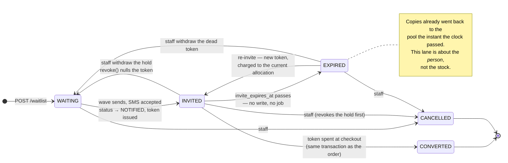

# The waitlist queue system

How a print run gets handed out fairly: people join a queue, the shop decides how much
of a restock the queue is allowed to eat, invites go out in waves against that budget,
each invite is a dated hold on real copies, and every hold ends as either a sale or
stock back on the shelf.

This is the design document for that system — states, invariants, and what has to be
built. It supersedes nothing: [waitlist-invite-flow.md](./waitlist-invite-flow.md) still
describes the token mechanism accurately and is the reference for how a link is minted,
redeemed and spent. This one describes the machine that decides *who gets a link and
when*, which is the part that does not exist yet.

Companion to [backend-architecture.md](./backend-architecture.md).

---

## 1. The five steps, and where we actually are

| #   | Step                                   | Today                                                             | Verdict            |
| --- | -------------------------------------- | ----------------------------------------------------------------- | ------------------ |
| 1   | Join the queue                         | `waitlist_entries`, `PENDING`, ordered `created_at asc`            | **Done**           |
| 2   | Decide how much of the stock the queue gets | Nothing. The invite budget is the entire `stock_quantity`      | **Missing**        |
| 3   | Allocate — invite in waves             | Manual multi-select; capacity capped at *all* stock, no wave record | **Half**           |
| 4   | The hold, with a deadline              | `invite_expires_at` + TTL setting; reservation subquery honours it | **Done**           |
| 5   | Recycle                                | Copies return automatically at expiry, but the person is stranded in `NOTIFIED` with a dead link and no Expired lane, and nothing pulls the next person up | **Half** |

Two things are genuinely absent, and they are the two the flow hinges on:

**There is no allocation.** `refuseBeyondStock` in `admin-waitlist-invite.service.ts`
computes an invite budget of `stock_quantity − reserved_elsewhere`. That is the whole
print run. A shop with 60 copies and 300 people waiting can invite until all 60 are
held, and a walk-in customer sees `sold out` for the entire window. Step 2 of the flow
exists precisely to stop that, and the code has no place to put the number.

**Expiry is invisible.** The clock releases the copies — that part is right and is the
best thing about the current design — but the entry itself stays `NOTIFIED` forever,
holding a token that resolves to a 404. There is no Expired tab, the status counts don't
know the state exists, and the person is neither reachable-again by an obvious action nor
back in line. Everything about step 5 after "the copies come back" is unbuilt.

The rest is in better shape than it looks. The hold is real, single-use, atomically
spendable, and already subtracted from what the public may buy
(`inventory/reservations.ts`). That is the hard part and it is done.

---

## 2. States

### 2.1 The rule: the lane is derived, the status is stored

An entry's tab is **computed**, never written. There is no `EXPIRED` value in
`waitlist_status` and there must not be one.

The reason is the invariant the current code already lives by, spelled out at the top of
`reservations.ts`: a copy is held for exactly as long as its token could still be spent,
and `invite_expires_at > now()` in SQL is what makes that true with no sweep to run. The
moment `EXPIRED` becomes a stored value someone has to write it, and between the instant
a hold lapses and the instant the sweeper runs, the database says the copy is held and
the shelf says it is free. That window is where a shop oversells. A stored lane would
also have to be re-derived on every read anyway to stay honest, at which point it is a
cache of a thing that was free to compute.

So: **`status` records what people decided. The clock decides the rest.**

```
lane(entry) =
  CANCELLED   if status = CANCELLED
  CONVERTED   if status = CONVERTED
  EXPIRED     if invite_token is not null
              and invite_used_at is null
              and invite_expires_at <= now()
  INVITED     if invite_token is not null
              and invite_used_at is null
              and invite_expires_at >  now()
  WAITING     otherwise
```

`INVITED` is exactly the condition `liveInviteConditions()` already uses to hold a copy
back — deliberately, not coincidentally. **A copy is off the public shelf if and only if
its entry is in the `INVITED` lane.** That single sentence is what makes the whole thing
auditable: the admin panel's Invited tab and the storefront's availability number are
answering the same question with the same expression.

This belongs in one file the way `reservations.ts` owns its expression — `waitlist-lane.ts`
exporting `laneSql()` and a matching `laneOf()` for rows already in memory. Two
hand-written copies of that condition is how the panel and the shelf start disagreeing.

### 2.2 The lanes



The four stored `status` values keep their current meanings and are not touched by this
design: `PENDING` (never reached), `NOTIFIED` (has been reached at least once, and
`notified_at` never restamps), `CONVERTED`, `CANCELLED`. `EXPIRED` and the split between
`WAITING` and `INVITED` come entirely from the token columns.

One consequence worth stating plainly: **a re-invited person shows as `NOTIFIED` in
`status` and `INVITED` in lane, and an expired person shows as `NOTIFIED` in `status`
and `EXPIRED` in lane.** `status` answers "have we ever reached them", the lane answers
"what is true right now". They are different questions and the panel should show the
lane.

### 2.3 The hold invariant

> A hold either becomes a sale or becomes stock again. There is no fourth outcome.

Three exits, all of which release the copies:

| Exit           | Mechanism                                    | Releases how                                             |
| -------------- | -------------------------------------------- | -------------------------------------------------------- |
| **Buys**       | `consume()` sets `invite_used_at` in the order's transaction | Falls out of `liveInviteConditions` (`used_at is null` fails); the stock decrement in the same transaction is the real handover |
| **Expires**    | Wall clock passes `invite_expires_at`        | Falls out of `liveInviteConditions` (`expires_at > now()` fails) |
| **Withdrawn**  | `revoke()` nulls all token columns, guarded to unspent | Falls out of `liveInviteConditions` (`invite_token is not null` fails) |

All three are already implemented and all three are already correct. What this design
must not do is introduce a fourth path. The two places it could:

- **An allocation being deleted while holds are live against it.** Allocations are
  closed, never deleted, and the FK from an entry's wave must be `restrict` on delete.
- **An admin lowering `stock_quantity` below what is currently held.** Already handled —
  `publicAvailableSql` floors at zero so the shelf reads sold-out rather than negative —
  but the *allocation* screen must surface it loudly, because it is the one state where
  the shop has promised more copies than it owns and only a human can resolve it.

---

## 3. Allocation: the missing entity

### 3.1 What it is

An allocation is a business decision, made once per restock, recorded before anyone is
contacted: **of the N copies that just landed, M are the waitlist's to spend.**

```
waitlist_allocations
  id
  book_id            → books.id, restrict on delete
  copies             int > 0    the waitlist's budget for this release
  stock_snapshot     int        stock_quantity when the decision was made,
                                so "50 of 60" is still legible next year
  note               text       "Sept restock, 10 held for the shop counter"
  status             OPEN | CLOSED
  opened_at, opened_by_id, opened_by_email
  closed_at, closed_by_id, closed_by_email
```

At most one `OPEN` allocation per book — a partial unique index on
`(book_id) where status = 'OPEN'`. Two open budgets for the same title is two people
spending the same copies, which is the exact failure this table exists to prevent.

`copies` is a cap on invites, not a partition of inventory. The shop's 10 walk-in copies
are not marked or held anywhere — they are protected structurally, because
`publicAvailableSql` is `stock − live holds`, and live holds can never exceed 50 if only
50 invites are ever issued. The walk-in reserve is what's left over by arithmetic. That
is much safer than a second reserved-pool column that could drift from the first.

### 3.2 The budget equation

```
committed(A)  = Σ quantity of entries whose wave belongs to A
                where invite_used_at is not null        -- sold through this allocation
                   or invite_expires_at > now()         -- still being held

remaining(A)  = A.copies − committed(A)
```

Expired-and-unspent entries are absent from `committed` by construction, which means
**recycling is not an operation.** When a wave's window closes, `remaining` simply goes
up on its own, the same way the public shelf refills on its own today. There is no job,
no sweep, nothing to schedule, and nothing that can fail to run. This is the same trade
`reservedQuantitySql` makes and for the same reason its comment gives: a stored counter
would be faster and would eventually be wrong, silently.

`remaining(A)` is also not allowed to exceed what physically exists. The number staff
actually get to spend on a wave is:

```
spendable(A) = min( remaining(A), stock_quantity − reserved(book) )
```

The second term is the existing `refuseBeyondStock` check, which stays exactly as it is.
Allocation is a *narrower* budget layered on top; it never widens one. If someone sets
`copies = 80` on a 60-copy book, physical stock still wins and the panel shows why.

### 3.3 Waves

```
waitlist_invite_waves
  id
  allocation_id      → waitlist_allocations.id, restrict on delete
  wave_number        int, 1-based, unique per allocation
  invited_count      int    entries that got a link
  invited_quantity   int    copies those links hold
  ttl_hours          int    snapshot of the setting at send time
  closes_at          timestamptz   sent_at + ttl_hours
  sent_at, sent_by_id, sent_by_email
```

And on `waitlist_entries`, two new columns:

- `invite_wave_id` — which wave issued the token this entry is holding. Joins the entry
  to its allocation. **It moves with the other three invite columns**: set by `issue()`,
  nulled by `revoke()`, and added to the existing
  `waitlist_entries_invite_columns_together` CHECK so a token can never exist without
  knowing which budget it was charged to.
- `invite_attempts` — how many links this entry has ever been sent. Increments on every
  `issue()`, never resets. Two jobs: it is the fairness key in §4.2, and it is what
  stops a phone that never answers from consuming a slot in every wave forever.

`closes_at` on the wave is a snapshot, not the authority — the entry's own
`invite_expires_at` is what any check reads. They are written from the same value in the
same operation, and the wave's copy exists so the panel can say "wave 2 closes in 6
hours" without scanning entries.

Why a table rather than reading it off the audit log: the audit log already records who
invited whom, but it records it as a JSON blob you cannot join, aggregate or filter a
list by. "Which wave is this person in, and has it closed" is a question the panel asks
on every render.

---

## 4. The flow, end to end

```mermaid
sequenceDiagram
  autonumber
  actor Staff
  participant Alloc as /admin/waitlist/allocations
  participant Api as AllocationService
  participant Wave as WaveService
  participant Inv as AdminWaitlistInviteService
  participant Db as waitlist_entries
  actor Cust as Customer

  Note over Staff,Api: Step 2 — before anyone is contacted
  Staff->>Alloc: 60 copies landed. Waitlist gets 50.
  Alloc->>Api: open allocation { bookId, copies: 50 }
  Api->>Api: refuse if an OPEN allocation exists for this book
  Api->>Api: warn if 50 > stock − live holds

  Note over Staff,Db: Step 3 — wave 1
  Staff->>Wave: "Invite next 50"
  Wave->>Db: front of queue, fairness order, until Σ quantity = spendable
  Wave->>Wave: open wave 1, closes_at = now + TTL
  Wave->>Inv: send to exactly those ids
  loop 5 in flight
    Inv->>Db: issue() — token, mode, expires_at, wave_id, attempts + 1
    Inv->>Db: SMS outcome; PENDING → NOTIFIED only if it sent
  end
  Note right of Db: 50 copies now off the public shelf.<br/>remaining(A) = 0.

  Note over Cust,Db: Step 4 — the window
  Cust->>Db: 31 redeem → CONVERTED, committed for good
  Note over Db: 19 do not. At closes_at they fall out of<br/>liveInviteConditions with no write.<br/>remaining(A) = 19. Lane = EXPIRED.

  Note over Staff,Db: Step 5 — wave 2
  Staff->>Wave: panel shows "19 copies came back — invite next 19"
  Wave->>Db: next 19 by fairness order:<br/>never-invited first, then the 19 who lapsed
  Wave->>Inv: send wave 2
  Note over Staff,Api: repeat until queue empty or allocation spent
```

### 4.1 Waves, not overbooking

The wave size is `spendable(A)` and nothing larger. We are not inviting 70 for 50 copies
on the assumption that some won't show.

Overbooking is a real strategy and it is the right one for an airline, where the failure
case is a stranger you compensate at a published rate and never see again. Here the
failure case is a Bangladeshi customer who got an SMS saying a copy was theirs, filled in
a checkout form, and was told no — and who is going to say so publicly, to an audience
that overlaps almost entirely with the shop's next hundred customers. The upside of
overbooking is a slightly faster sell-through. It is not worth it, and the decision is
recorded here so it doesn't get quietly re-litigated by someone adding a "fudge factor"
field later.

The cost of waves is latency: a copy whose holder ignores the SMS sits idle for the
entire TTL. That is what the TTL setting is for. 48 hours is the current default; a
restock with a long queue behind it is an argument for 24, not for overbooking.

### 4.2 Who gets invited next

```sql
-- candidates
lane in (WAITING, EXPIRED)      -- not cancelled, not converted, not currently holding
and book_id = A.book_id

-- order
order by invite_attempts asc,   -- never-invited before anyone getting a second turn
         created_at   asc,      -- then the queue's own promise: first to sign up
         id           asc       -- stable tiebreak; offset paging drops rows without it
```

`invite_attempts asc` is step 5's "they go back into the queue, usually behind those who
haven't had a turn yet", expressed as one clause. Everyone gets a first turn before
anyone gets a second; among people on equal footing, signup order decides — and signup
order is, as the flow says, the only fairness rule that doesn't need defending.

The wave is filled by walking that list and taking entries while `Σ quantity` fits in
`spendable(A)`. Sequentially, in one pass, before any SMS is sent — which is what
`refuseBeyondStock` already does and for the reason its comment gives: five concurrent
capacity checks each see the same remaining budget and each claim it.

An entry that doesn't fit is **skipped, not stopped on**. Someone asking for 5 copies
with 3 left shouldn't block the four people behind them who want one each. But skipping
must not be silent — a large entry that keeps getting passed over is exactly the case
that needs a human, so it surfaces in the panel as "3 entries skipped this wave (want
more copies than remain)" with the option to invite them anyway against the next one.

### 4.3 Re-inviting an expired entry

The mechanism already works: `issue()` overwrites the token, which kills the old link by
replacing the value it pointed at, and clears `invite_used_at`. Three things change.

**It costs budget again.** A re-invite is a new hold on a real copy and must be charged
to whichever allocation is `OPEN` now, via a new `invite_wave_id`. The old wave's record
of it stays as history on that wave's counters.

**It must not double-charge.** `refuseBeyondStock` already handles this with
`excludeEntryIds` — an entry about to have its token rewritten shouldn't have its *old*
reservation counted against the batch that is renewing it. An expired entry holds nothing
anyway, so this is only load-bearing when re-inviting someone whose link is still live.
The existing logic covers both; it just needs the allocation budget applied alongside it.

**It is a one-click action from the Expired tab.** "Select all expired for this book →
Invite" is the single most common restock-morning action after wave 1 closes, and it is
currently a filter query with no button attached.

---

## 5. What the panel looks like

**Tabs become lanes**, not statuses: `Waiting · Invited · Expired · Converted · Cancelled`,
with counts computed under every active filter except the lane itself — the same rule
`statusCounts` already follows so the numbers can't disagree with the rows.

**A per-book release header**, shown when a `bookId` filter is active:

```
JLPT N5 Grammar — 60 in stock
Allocation: 50 to the waitlist · 31 sold · 0 held · 19 available     [Close release]
Wave 2 of 2 closed 3h ago · 41 still waiting · 19 lapsed
                                                     [ Invite next 19 ]
```

Every number there is derived. `held` is the live-invite sum, `available` is
`remaining(A)`, `lapsed` is the Expired lane count. Nothing on this header is stored,
so nothing on it can be stale.

**The invite button is budget-aware.** Today the panel offers "Invite N selected" and
finds out about capacity in the response. It should offer "Invite next N" against
`spendable(A)`, with manual selection kept as the override for the cases a queue can't
express — a customer who called the shop, a bulk order for a school.

**Waves are triggered by a person, not a cron.** The panel tells staff a wave is ready
and how big it can be; a human presses the button. Three reasons: the SMS gateway is one
Android phone with one SIM and sends are billed, there is no job runner in the system
today (every send happens inside the request that asked for it), and a restock morning is
already a moment someone is watching. An automatic next-wave is a reasonable phase-4
feature; it is not the thing to build first, and it should never be the thing that
discovers the gateway is offline.

---

## 6. What has to change

Ordered so each phase is independently shippable and useful on its own.

### Phase 1 — Lanes (no new tables)

The whole of §2, and it is worth doing alone: it turns expiry from an invisible state
into a tab, which is half the complaint.

- `apps/api/src/waitlist/waitlist-lane.ts` — `laneSql()` and `laneOf()`, single
  definition, mirroring `liveInviteConditions` deliberately and saying so in a comment.
- `packages/contracts/src/admin-waitlist.ts` — `waitlistLanes` const, `lane` on the entry
  schema, `lane` filter replacing/absorbing `inviteState`, counts keyed by lane.
- `admin-waitlist.query.ts` — filter and order by lane; counts skip the lane clause the
  way they skip status today.
- `admin-waitlist.mapper.ts` — emit `lane` per row.
- Web: tabs, an Expired tab with a "Re-invite selected" action wired to the existing
  `POST /admin/waitlist/invite`.
- Keep `status` and its filter exactly as they are. Nothing migrates, nothing backfills.

### Phase 2 — Allocations

- Migration: `waitlist_allocations`, partial unique index on `(book_id) where status = 'OPEN'`,
  `check (copies > 0)`.
- `waitlist-allocation.service.ts` — open, close, `remaining()`, `spendable()`. Derived
  queries only; no counters on the row.
- `refuseBeyondStock` gains the allocation budget as a second, narrower cap, with its own
  refusal message ("this release allocated 50 copies to the waitlist and 50 are spoken
  for") — distinct from the physical-stock message, because they call for different
  actions from staff.
- Admin screen: open/close a release, see the header of §5.
- Books with no open allocation: **invites are refused**, with an explicit "open a release
  first" error. Falling back to "the whole print run" is how the current behaviour comes
  back through the side door.

### Phase 3 — Waves and fairness

- Migration: `waitlist_invite_waves`; `invite_wave_id` and `invite_attempts` on
  `waitlist_entries`; extend `waitlist_entries_invite_columns_together` to include
  `invite_wave_id`; FK `restrict` on both new references.
- `issue()` takes a `waveId` and increments `invite_attempts` in the same UPDATE.
- `revoke()` nulls `invite_wave_id` with the other three.
- `waitlist-wave.service.ts` — pick the next wave by §4.2, open the wave row, hand the ids
  to the existing send loop, record counts.
- `POST /admin/waitlist/waves` (open + send) and the "Invite next N" button.
- Backfill: existing entries get `invite_attempts = 1` where a token was ever issued
  (`invite_sms_at is not null or invite_token is not null`), `0` otherwise;
  `invite_wave_id` stays null on historical rows and the budget query treats a null wave
  as belonging to no allocation. Pre-existing live holds therefore still count against
  physical stock — correct — but not against any release, which is the honest reading:
  they were issued before releases existed.

### Phase 4 — Optional

Auto-advance a wave when the previous one closes (needs a job runner — the same one the
"bulk invites still send inside the request" gap in the invite doc has been waiting for).
Per-allocation conversion reporting. A customer-facing "you're #14 in line" number, which
is easy to compute and hard to promise, so it should be a separate decision.

---

## 7. Decisions to confirm before Phase 2

1. **One allocation per book at a time, or several?** This design says one open at a
   time. Several would let a shop run "50 for the JLPT queue, 10 for the JFT queue" on
   the same title, which is not a thing the shop does today, and the constraint is much
   easier to relax later than to add.
2. **Does closing a release revoke its live holds?** This design says no — closing stops
   new waves, and existing holds run out their windows, because a customer holding a
   valid link should never have it die because staff tidied up. A separate explicit
   "withdraw all holds" action for the case where it genuinely is needed.
3. **Do the legacy `bookId is null` entries matter?** Signups have required a book since
   `f862b6d`. Any pre-existing general entries can only ever be invited `OPEN`, reserve
   nothing, and belong to no allocation. Either exclude them from wave picking entirely,
   or assign them a book by hand first. Excluding them is the safe default.
4. **TTL per release, or shop-wide?** Currently shop-wide
   (`waitlist_invite_ttl_hours`, default 48). A `ttl_hours` override on the allocation is
   a small addition and the natural place to say "this one's a 24-hour window because 300
   people are waiting". The wave already snapshots whatever was used.

---

## 8. Known gaps this does not close

- **Delivery still means "the gateway accepted it."** A carrier dropping the SMS is
  invisible, so a wave's "50 invited" is 50 messages handed to a phone, not 50 messages
  read. Unchanged from today, and it is the strongest practical argument for a 48-hour
  window over a 24-hour one.
- **Conversion only closes for invited orders.** Someone who ignores their link and
  walks into the shop still leaves their entry sitting in `EXPIRED`. Matching them back
  needs a rule, and phone equality is wrong for a shared household number.
- **Bulk sends still run inside the request**, five at a time. A 50-invite wave is fine;
  the ceiling is the same as it is today, and the answer is still a job table and a
  worker rather than a bigger loop.
- **Nothing tells a customer where they are in the queue.** Position is computable but
  becomes a promise the moment it is shown, and it moves backwards whenever someone
  ahead lapses and is re-queued. Deliberately out of scope.
